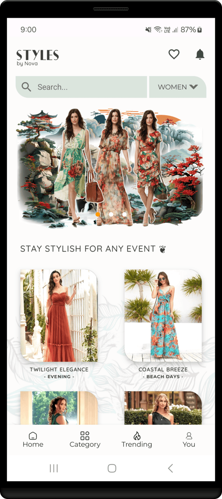
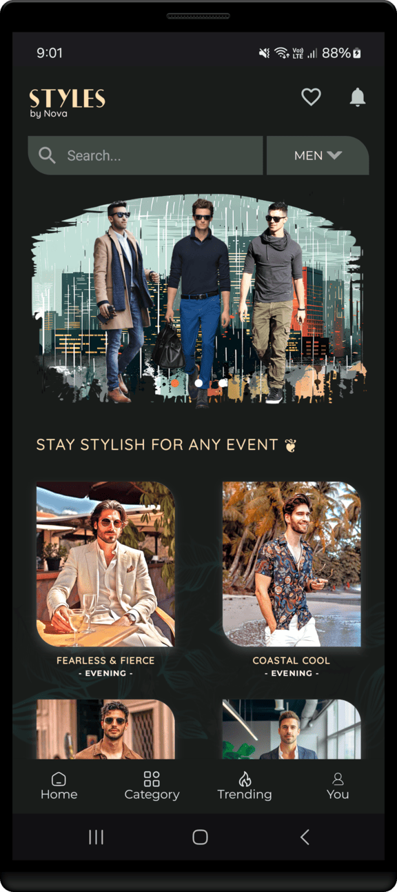
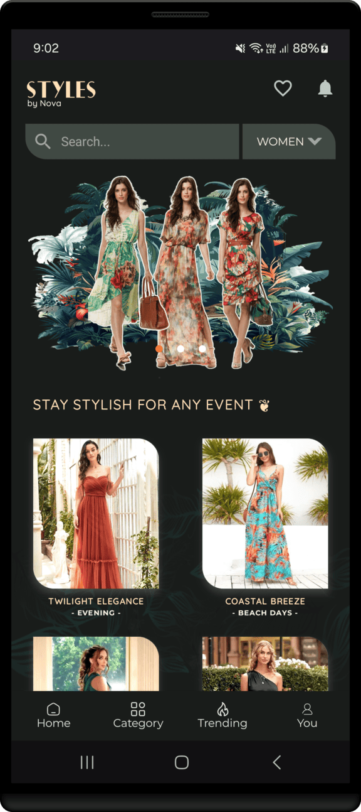
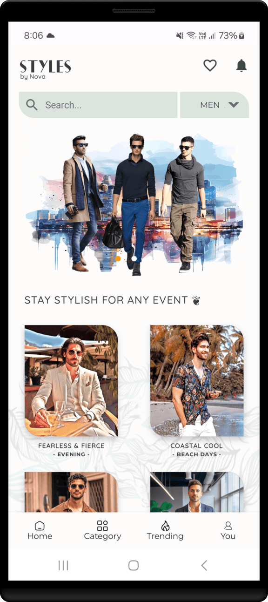

<h1 align="center" >  𝐒𝐓𝐘𝐋𝐄𝐒 𝚋𝚢 𝙽𝚘𝚟𝚊  <br> ♨ [ ᴀɴᴅʀᴏɪᴅ  ᴘʀᴏᴊᴇᴄᴛ ] ♨</h1>

## ɪ  ⁃  ᴘʀᴏᴊᴇᴄᴛ ɪɴꜰᴏ

> [!Note]
> **This project is still in its early development stage.**
#

𝑁𝑜𝑣𝑎 𝑆𝑡𝑦𝑙𝑒𝑠 ( 𝐒𝐓𝐘𝐋𝐄𝐒 𝚋𝚢 𝙽𝚘𝚟𝚊 ) is your go to fashion app for men, women, and kids, offering fresh style tips, trending outfits, and grooming advice to keep you looking your best.

<br>

<div align="center">

⁃ ᴄᴏɴᴛᴇɴᴛꜱ ⁃  
[ᴜꜱᴇʀ ꜰᴇᴀᴛᴜʀᴇꜱ](#ɪɪ--ᴡʜᴀᴛ-ᴜꜱᴇʀꜱ-ᴄᴀɴ-ᴇxᴘᴇᴄᴛ)
| [ᴀᴘᴘ ꜱᴄʀᴇᴇɴꜱ](#ɪɪɪ--ᴠɪꜱᴜᴀʟ-ᴛᴏᴜʀ-ᴏꜰ-ᴛʜᴇ-ᴀᴘᴘ-ꜱᴄʀᴇᴇɴꜱ)
| [ᴘʀᴏᴊᴇᴄᴛ ʙʀᴀɴᴄʜᴇꜱ](#ɪᴠ--ᴘʀᴏᴊᴇᴄᴛ-ʙʀᴀɴᴄʜᴇꜱ)
| [ᴅᴇᴠ ꜰᴇᴀᴛᴜʀᴇꜱ](#ᴠ--ʙᴇʜɪɴᴅ-ᴛʜᴇ-ᴄᴏᴅᴇ-ᴅᴇᴠ-ꜰᴇᴀᴛᴜʀᴇꜱ)
| [ᴘʀᴏᴊᴇᴄᴛ ɴᴏᴛᴇꜱ](#ᴠɪ--ᴘʀᴏᴊᴇᴄᴛ-ɴᴏᴛᴇꜱ)

<br>
<br>

[](#)
[](#)

[](#)
[](#)
[](#)
[](#)
[](./LICENSE)
<br>
<br>




<br>

</div>

## ɪɪ ⁃ ᴡʜᴀᴛ ᴜꜱᴇʀꜱ ᴄᴀɴ ᴇxᴘᴇᴄᴛ

### ⭓ Features

- **Personalized Fashion Tips**: Tailored outfit suggestions for men, women, and kids.
- **Trending Styles**: Latest fashion trends and seasonal collections.
- **Grooming Advice**: Expert tips on grooming and self-care.
- **Daily Style Inspirations**: Fresh outfit ideas for everyday wear or special occasions.
- **Style Alerts**: Notifications for new fashion releases and sales.
- **Size and Fit Guide**: Help finding the perfect fit for any clothing item.
- **Fashion News**: Updates on global fashion trends and designer highlights.
- **Shopping Links**: Easy access to buy recommended outfits and accessories.

##
### ⭓ Requirements
- Android 7.0 and Above
  - Min SDK version 24 (Android 7.0)


##
### ⭓ Permissions
- Internet

<hr>

## ɪɪɪ ⁃ ᴠɪꜱᴜᴀʟ ᴛᴏᴜʀ ᴏꜰ ᴛʜᴇ ᴀᴘᴘ: ꜱᴄʀᴇᴇɴꜱ

<p align="center">




</p>


#
<div align="center">


  <br>

<kbd>[&nbsp; ⮝ &nbsp;  BACK TO TOP  &nbsp;&nbsp;&nbsp;](#ɪ----ᴘʀᴏᴊᴇᴄᴛ-ɪɴꜰᴏ) </kbd>
</div>


#
## ɪᴠ ⁃ ᴘʀᴏᴊᴇᴄᴛ ʙʀᴀɴᴄʜᴇꜱ

<!-- Main / Master / Production Branch -->

> <samp> **PRODUCTION BRANCH :**  </samp>  
> Stable code for deployment  
> ➲ [main][branch-main]

> <samp> **STAGING BRANCH :**  </samp>  
> `FLOW | Staging → Production`  
> For pre-release testing, which ensures that the code is stable, bug-free, and ready for deployment.  
> ➲ [staging][branch-staging]

> <samp> **DEVELOPMENT BRANCH :**  </samp>  
> `FLOW | Development → Release → Staging → Production`  
> Active codebase for ongoing development efforts  (New features, bug fixes, and improvements..)  
> ➲ [development][branch-development]


> <samp> **FEATURE BRANCHES :** N/A  </samp>  
> `FLOW | Feature → Development → Release → Staging → Production`  
<!-- 
> <samp> **FEATURE BRANCHES :**  </samp>  
> For Isolated feature development (Ensures changes are tested and reviewed before merging into the main workflow)  
>   
> feature/  
> ➲ dark-theme  
> ➲ offline-db-impl
-->


> <samp> **RELEASE BRANCHES :** N/A  </samp>  
> `FLOW | Release → Staging → Production`  
<!-- 
> <samp> **RELEASE BRANCHES :**  </samp>  
> Prepares the code for final testing and deployment in a new version release.
>   
> release/  
> ➲ version-number
-->


> <samp> **HOTFIX BRANCHES :** N/A  </samp>  
> `FLOW | Hotfix → Staging → Production`  
<!-- 
> <samp> **HOTFIX BRANCHES :**  </samp>  
> Handles critical fixes in production that need immediate resolution.
>   
> hotfix/  
> ➲ main-screen-crash 
-->


> <samp> **BUGFIX BRANCHES :** N/A  </samp>  
> `FLOW | Bugfix → Development → Release → Staging → Production` 
<!-- 
> <samp> **BUGFIX BRANCHES :**  </samp>  
> Addresses specific bugs identified during development and testing.
>   
> bugfix/  
> ➲ main-screen-error
-->

<!-- 
> <samp> **EXPERIMENTAL BRANCHES :** N/A  </samp>  

> <samp> **EXPERIMENTAL BRANCHES :**  </samp>  
> Facilitates trial and error to test new ideas and concepts.
>   
> experiment/  
> ➲ main-screen-change-colours
-->
<!-- Experimental → Feature → Development → Release → Staging → Main/Production   -->


[branch-main]:  https://github.com/NovaLogics/styles-by-nova-android-app/tree/main
[branch-development]:  https://github.com/NovaLogics/styles-by-nova-android-app/tree/development
[branch-staging]:  https://github.com/NovaLogics/styles-by-nova-android-app/tree/staging

[branch-feature-NAME]:  https://github.com/dizzcode/nova-styles-android-app/tree/staging

[branch-hotfix-NAME]:  https://github.com/dizzcode/nova-styles-android-app/tree/staging

[branch-bugfix-NAME]:  https://github.com/nova-styles-android-app/tree/staging

<br>  


#
## ᴠ ⁃ ʙᴇʜɪɴᴅ ᴛʜᴇ ᴄᴏᴅᴇ: ᴅᴇᴠ ꜰᴇᴀᴛᴜʀᴇꜱ


### ⭓ Project Documents

<br>

1. **Managing Dependencies with Version Catalogs** &nbsp;| &nbsp;  [ Read -> ](./_assets/docs/doc-version-catalogs.md)

2. **Jetpack Compose Project Structure Guide** &nbsp;|&nbsp;  [ Read -> ](./_assets/docs/doc-project-structure.md)

3. **Dimension Standards in Android** &nbsp;|&nbsp;  [ Read -> ](./_assets/docs/doc-dimension-resource.md)


#
### ⭓ App Dependencies/Libraries Overview

<br>

* [Kotlin][0] : Kotlin is statically typed & first-class language for Android Development.
* [Coroutines][1] : For Asynchronus or non-blocking operations.
* [Flows][2] : Data Streaming API which is built on top of Coroutines.
* [Jetpack Compose][3] : Toolkit for building native UI in a declarative way.
* [Room][4] : Save data in a local database using Room
* [Retrofit][5] : Type-safe REST client for Android to consume RESTful web services.
* [Dagger Hilt][6] : Dependency injection library for Android.
* [Kotlin DSL][7] : For writing gradle script for Kotlin is more readable and offers better compile-time.

[0]:  https://kotlinlang.org/
[1]:  https://kotlinlang.org/docs/coroutines-overview.html
[2]:  https://developer.android.com/kotlin/flow
[3]:  https://developer.android.com/jetpack/compose
[4]:  https://developer.android.com/training/data-storage/room
[5]:  https://github.com/square/retrofit
[6]:  https://dagger.dev/hilt/
[7]:  https://docs.gradle.org/current/userguide/kotlin_dsl.html

#
### ⭓ Versions

<details>
 <summary> Version Details</summary>

- Min SDK : 24
- Target SDK  : 34
- Compile SDK : 34
- Java Version : 17
- Gradle Version : 8.7
- Compose Version :1.7.3
- Kotlin Version : 2.0.20
- Dagger Hilt Version : 2.52
- Android Gradle Plugin Version : 8.5.2
  <br>

 </details>


#
### ⭓ Features

1. Development process info &nbsp;|&nbsp;  [ More-> ](#1-project-log)
2. Project Resources &nbsp;|&nbsp;  [ More-> ](#2-project-resources)


#
<div align="center">

<kbd>[&nbsp; ⮝ &nbsp;  BACK TO TOP  &nbsp;&nbsp;&nbsp;](#ɪ----ᴘʀᴏᴊᴇᴄᴛ-ɪɴꜰᴏ) </kbd>
</div>


#
# ᴠɪ ⁃ ᴘʀᴏᴊᴇᴄᴛ ɴᴏᴛᴇꜱ

<br> 

____

## 1. Project Log

<details>
 <summary> Init Project </summary>
<br>

1. Add Top Libraries and Plugins to the Project &nbsp;|
   &nbsp; [ More Info -> ](./_assets/docs/doc-version-catalogs.md#13-top-libraries-and-plugins-for-project-development)
2. Add App icon using Resource Manager > Image Asset
3. Update Project Structure According to
   &nbsp;&nbsp;  [ Project Structure Document -> ](./_assets/docs/doc-project-structure.md)
4. Add fonts, colors, shapes, dimes, theme
5. Add necessary Strings/Texts, icons, images, placeholders
6. Add Dagger hilt
7. Add Common UI components
8. Add Main & Home screens

 </details>

<br>

#
<kbd>[&nbsp; ► &nbsp;  BACK TO Project Notes  &nbsp;&nbsp;&nbsp;](#ᴠɪ--ᴘʀᴏᴊᴇᴄᴛ-ɴᴏᴛᴇꜱ) </kbd>
____


## 2. Project Resources

<br> 

<details>
 <summary> View Project Resources Details </summary>

<br>

*Import : **Fonts** from*
```yaml
https://fonts.google.com/
```

<br> 


*Import : **Colours** from*
```yaml
https://htmlcolorcodes.com/colors/
```

```yaml
https://www.materialpalette.com/orange/brown
```

<br> 

*Select : **Theme** from*

```yaml
https://material-foundation.github.io/material-theme-builder/
```


 </details>


<br>

#
<kbd>[&nbsp; ► &nbsp;  BACK TO Project Notes  &nbsp;&nbsp;&nbsp;](#ᴠɪ--ᴘʀᴏᴊᴇᴄᴛ-ɴᴏᴛᴇꜱ) </kbd>
____


<br>

<hr>
<div align="center">

<kbd>[&nbsp; ⮝ &nbsp;  BACK TO TOP  &nbsp;&nbsp;&nbsp;](#ɪ----ᴘʀᴏᴊᴇᴄᴛ-ɪɴꜰᴏ) </kbd>
</div>
<hr>
<br>
